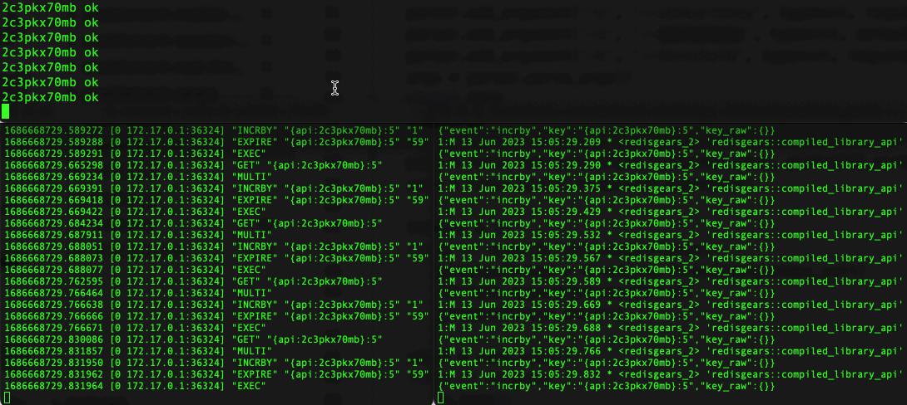

# Redis Rate Limiter

In the rate-limiting use case, each user token is allowed a certain number of requests in a limited amount of time. One of the simplest algorithms that solve this problem is the "Fixed window counter" algorithm which checks the number of calls in a specific time interval.  Implementing this algorithm with Redis is straightforward and is based on counters. The traditional logic of a rate limiter implies that the API gateway checks the current calls in a specific minute.

```
GET {[user-api-key]}:[current minute number]
```

> an example of counter per token and per minute is `{api:0ubo9qku7y}:54`, where we use curly brackets around a portion of the counter name to co-locate all the counters for a token in the same shard and together with additional data, as explained in the next section.

If the counter is under a threshold, we increase it using the following transaction and allow the request from the client. Otherwise, we deny the operation until the next minute, when we will restart the count with a new counter.

```
MULTI
INCR {[user-api-key]}:[current minute number]
EXPIRE {[user-api-key]}:[current minute number] 59
EXEC
```


## An enhanced Rate Limiter

This basic implementation for a rate limiter can be expanded by adding per-token additional data, such as the last-updated timestamp. A proposal to extend the basic rate limiter *without making any changes to the application* involves using Triggers with JavaScript functions. Extending the basic rate limiter in this way can be achieved without impacting the application servers, as described below:

1. The existing counter `{[user-api-key]}:[current minute number]` keeps track of the number of requests per token in the current minute.
2. We attach a keyspace trigger that executes a JavaScript function whenever a counter is incremented.
3. When the counter is incremented, we store the last updated timestamp in a Hash co-located in the same shard as the counter itself, using a hashtag, for example `{[user-api-key]}:data`. Additional information can be stored in the Hash, such as the total number of requests for that token.


## Setup of the demo

This is a server-side rate limiter written in JavaScript and uses triggers to detect events on the API counters. 

You can test this proof-of-concept using the latest Docker image including the "Triggers and Functions" feature. Start a container as follows:

```
docker run -d --name my-redis-stack -p 6379:6379 redis/redis-stack:7.2.0-RC3
```

Clone this repository and import the Javascript library into the Redis Server:

```
redis-cli -x TFUNCTION LOAD REPLACE < ./limiter.js
```

A load generator is provided and written in Python. Now prepare the Python environment:

```
python3 -m venv limiter
source limiter/bin/activate
pip install redis
```

And start the demo as follows:

```
python3 generator.py --host localhost --port 6389 --concurrency 3 --threshold 100
```

Options to configure the load generator are:

```
--host          Host (default: 127.0.0.1)
--port          Port (default: 6379)
--user          User
--password      Password
--concurrency   Concurrency
--iterations    Iterations
--threshold     Allowed operations per minute
```




## Further developments

The same keyspace trigger can enhance the rate limiter with additional functionality, such as:

- Data in Hash data structures can be indexed, and querying the user metadata space with `FT.SEARCH` can provide useful information such as the oldest and newest token usage, sorting tokens by usage, sorting tokens by the total number of requests, and more.
- storing all the requests in a per-token time series, enabling token usage analytics (usage during a time window, averages, etc.).


